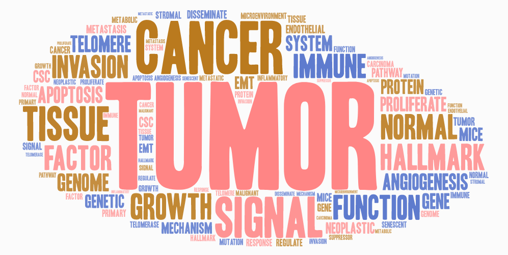

I'm **Lin Tian**, a post-doctoral researcher studying cancer biology.

I live in New York City, NY, USA.

I [work](https://www.mskcc.org/research/ski/labs/members/lin-tian) at [Memorial Sloan Kettering Cancer Center](https://www.mskcc.org/research/ski).

Contact me at [twitter@sjtubiolin](https://twitter.com/sjtubiolin) or email me [lintian0616@gmail.com]().

[Google Scholar](https://scholar.google.com/citations?user=5wYOhBIAAAAJ&hl=en)

[Vessel Normalization Project](https://github.com/lintian0616/vesselNormalization)

[Bone Metastasis Project](https://github.com/lintian0616/bica)
